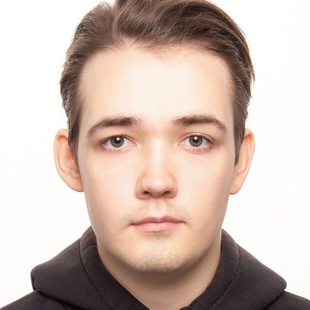

# Ruzanov Nikita

### ***Junior Frontend Developer***
***
## Contacts:
* Location: Samara, Russia
* Phone: +7 939 76 66 090
* E-mail: nikitruzanov@gmail.com
* GitHub: [nikitruzanov](https://github.com/nikitruzanov)
* Telegram: [nikitruzanov](https://t.me/nikitruzanov)
* Discord: nikitruzanov
***
## About Myself:
Hello! My name is Nikita, and I am a junior PHP developer with six months of experience in development. My passion for programming, servers, and cloud technologies started long ago, and this led me to decide to change my career and fully dedicate myself to IT. I am confident that I can realize my potential and achieve professional heights in this field.
***
## Skills:
### Backend Development
* PHP 7.4/8.2
* Symfony
* Laravel
* SQL
* PostgreSQL
* Twig
### Frontend Development
* HTML5
* CSS3
* Bootstrap
### DevOps & Tools
* Docker
* Git/GitLab
* Nginx
* GitLabCI
* Linux
### Project Management
* Atlassian Jira
* Atlassian Confluence
***
## Code example:
Timmy & Sarah think they are in love, but around where they live, they will only know once they pick a flower each. If one of the flowers has an even number of petals and the other has an odd number of petals it means they are in love.

Write a function that will take the number of petals of each flower and return true if they are in love and false if they aren't.
``` 
function lovefunc(flower1, flower2){
    return (flower1 % 2 !== flower2 % 2);
}
```
***
## Education:
* Incomplete Higher Education
  * Branch of the Eastern Economic and Legal Humanities Academy, Samara (2026)
  Economics, Accounting, Analysis and Audit (Economist)
***
## Experience:
### Project under NDA
*Samara*
**PHP - Backend Developer** *(January 2024 — Present, 6 months)*
* Working on two systems: ERP system on Symfony 5 with PHP 7.4 and multi-domain website system on Laravel with PHP 8.2, both using PostgreSQL and Docker.
* Responsible for system improvements, bug fixing, and developing additional modules.
* Developed integration modules and provided technical consultations.
### Project under NDA
*Samara*
**Project Manager** *(January 2023 — December 2023, 1 year)*
* Developed and implemented an access control system for confidential information.
* Optimized procurement and software update processes, reducing costs by 20%.
* Managed IT project resources, improving efficiency by 20%.
* Coordinated tasks, maintained schedules, and analyzed information.
### Mechanica
*Samara*
**Executive Assistant** *(December 2021 — June 2022, 7 months)*
* Optimized tender processes, securing two tenders worth over 10 million rubles.
* Improved managerial control, leading to a 50% staff increase.
* Implemented a financial management and workload control system.
* Assisted in the recruitment process and managed office operations.
***
## Courses:
* [PHP Course: Online Learning from Scratch](https://code-basics.com/ru/courses/php)
* [SymfonyBook](https://symfony.com/doc/current/index.html)
* [SQL - Academy](https://sql-academy.org/)
* [Free HTML Course](https://code-basics.com/ru/courses/html)
* [Free CSS Course](https://code-basics.com/ru/courses/css)
***
## Languages:
* Russian — Native
* English — A2 Elementary****

